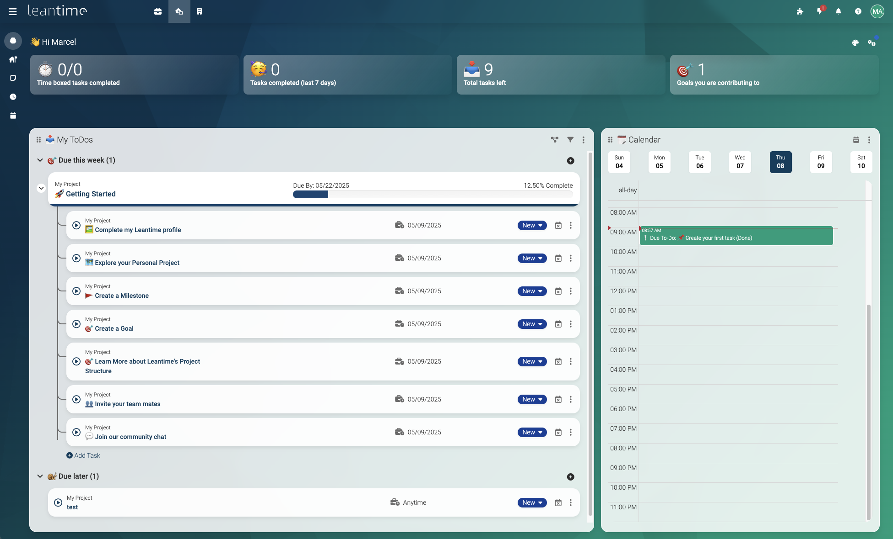
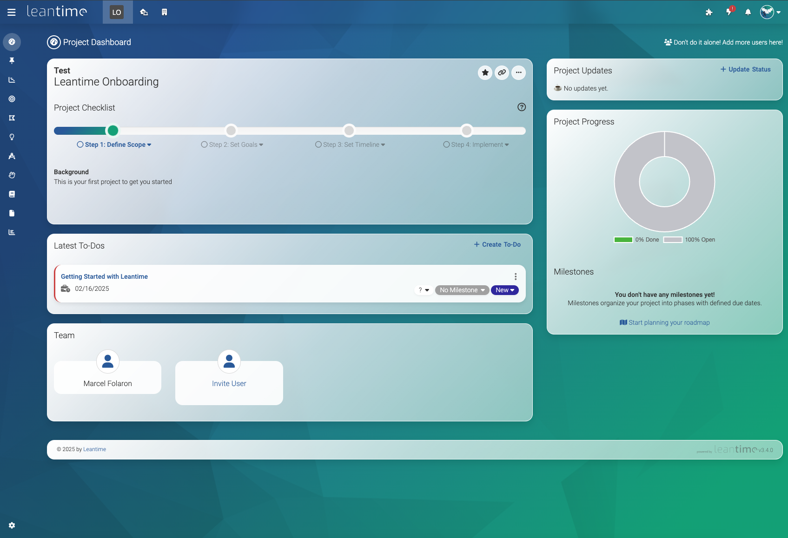
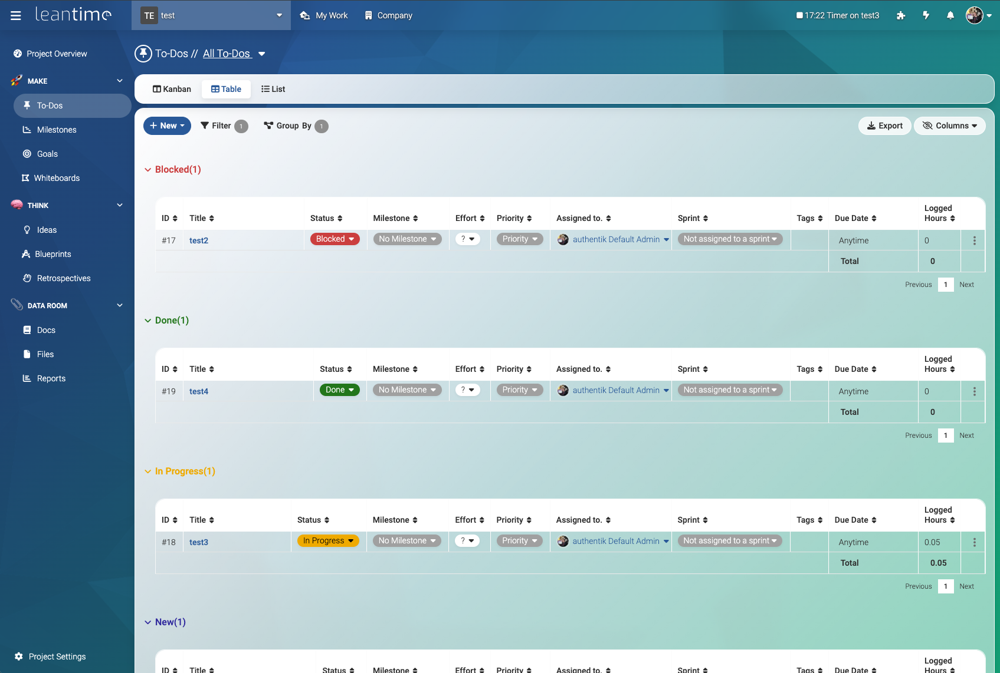
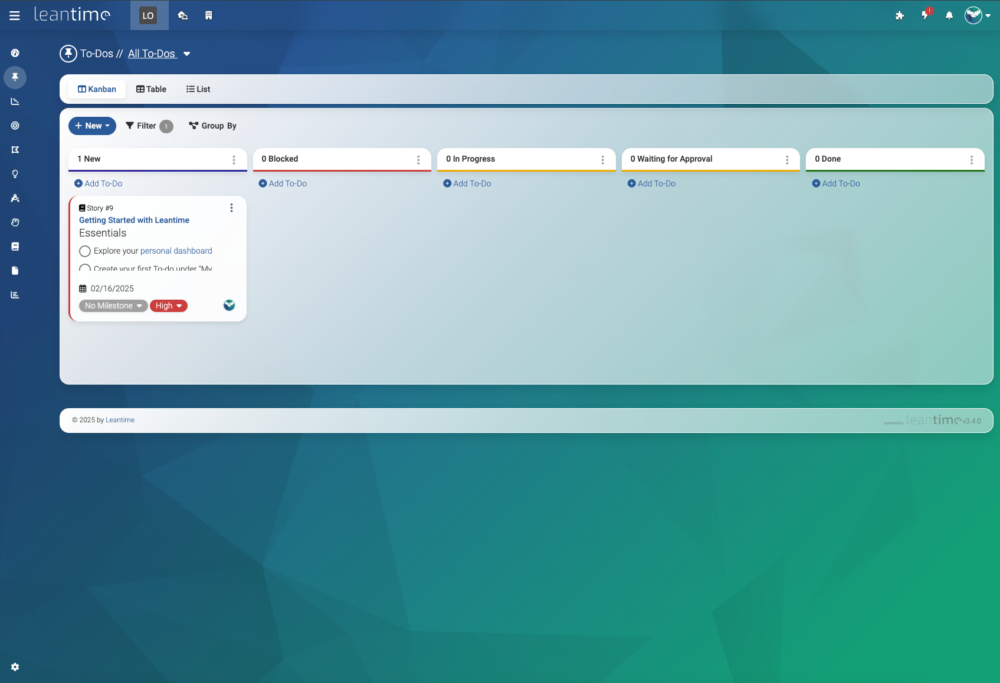
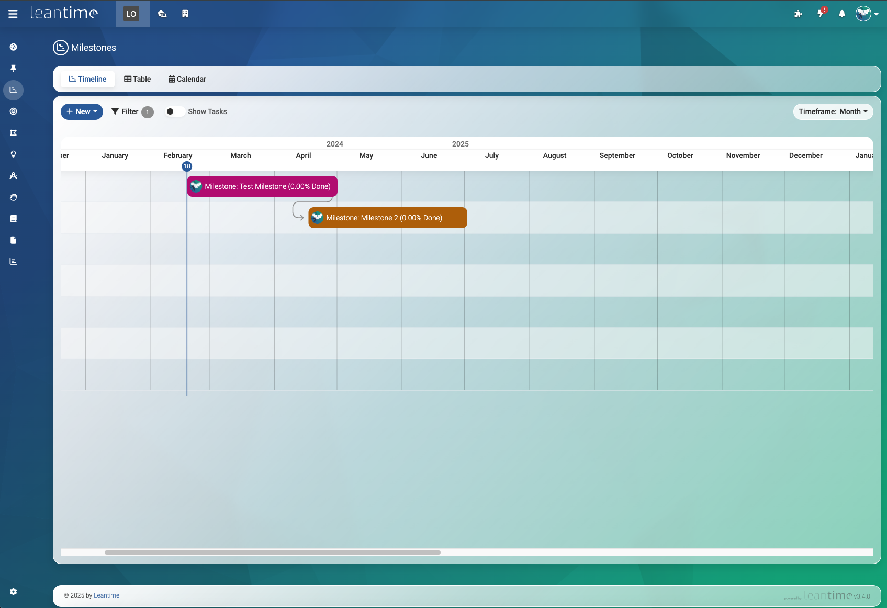
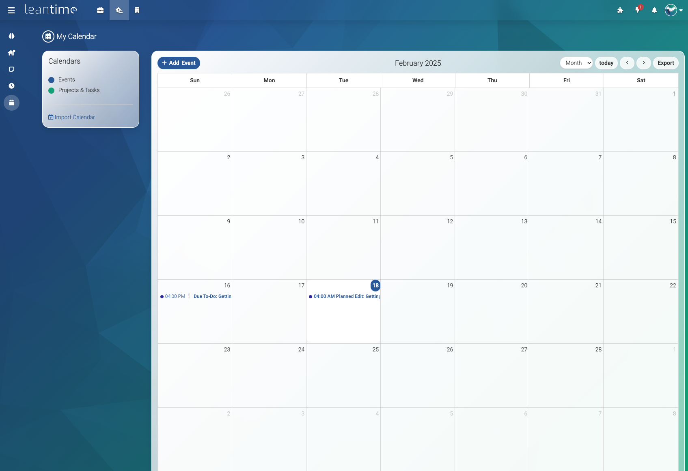
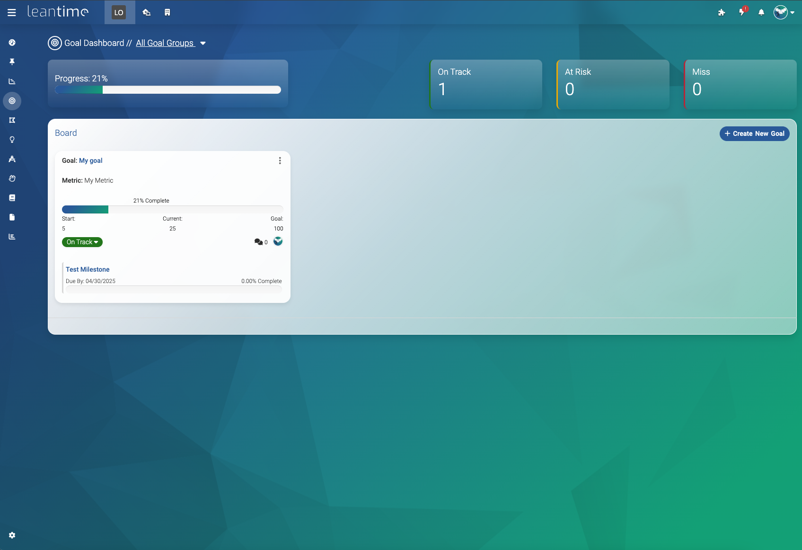
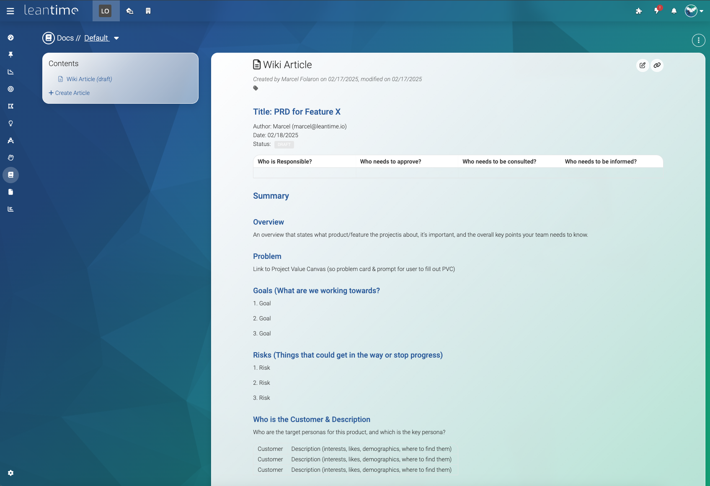
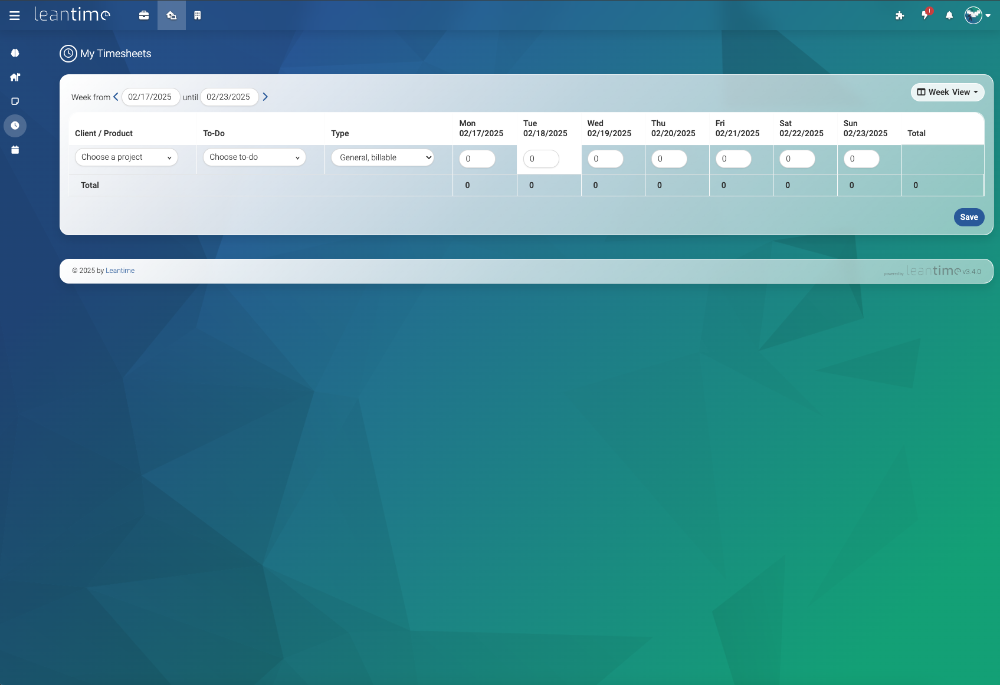

<div align="center">
<a href="https://safe4work.com"></a>

# Safe4Work&reg; 

⭐ If you find Safe4Work useful, please star us on GitHub! ⭐

## Empowering Through AI Innovation

Safe4All and Safe4Work represents the culmination of decades of experience in technology leadership, product development, and AI innovation, united by a shared vision to transform care management for neurodiverse individuals.

### Our Mission
To revolutionize care management through cutting-edge AI technology, creating personalized, accessible, and empowering solutions that promote independence and improve quality of life for neurodiverse individuals and their families.

### Core Principles

**AI-First Approach**  
Leveraging the latest advances in artificial intelligence, machine learning, and quantum computing to create truly intelligent care management systems.

**Human-Centered Design**  
Every feature is designed with empathy, accessibility, and the unique needs of neurodiverse individuals at the forefront.

**Trust & Security**  
Building secure, HIPAA-compliant solutions that protect privacy while enabling meaningful connections and support.

💪 Advanced project management with AI-powered insights<br />
🔄 A perfect alternative to ClickUp, Monday, or Asana<br />
🌐 [https://safe4work.com](https://safe4work.com)<br />

[](https://www.gnu.org/licenses/agpl-3.0.en.html)
[](https://hub.docker.com/r/safe4work/safe4work)

[](https://discord.gg/safe4work)

<br />

  

</div>
<br /><br />

## 🚀 Features ##
| Task Management                                                      | Project Planning                             | Information/Knowledge Management        | Administration                                  |
| -------------------------------------------------------------------- | -------------------------------------------- | --------------------------------------- |-------------------------------------------------|
| Task management via<br>kanban boards, gantt, table, list and calendar views | Project Dashboards, reports & status updates | Wikis / Docs                     | Easy installation                               |
| Unlimited subtasks and dependencies                                  | Goal & metrics tracking                      | Idea Boards                             | Multiple user roles and per project permissions |
| Milestone management                                                 | Lean & Business Model Canvas                 | Retrospectives                          | Two factor authentication                       |
| Sprint Management                                                    | SWOT Analysis canvas                         | File Storage via S3 or local filesystem | LDAP, OIDC integration                          |
| Timetracking & timesheets                                            | Risk Analysis                                | Screen & webcam recording               | Extendable via plugins and API                  |
|                                                                      | ... and more                                 | Comments/discussions on everything      | Integrates with Slack, Mattermost, Discord      |
|                                                                      | ... and more                                 |     | Available in over 20 languages                  |     

<br /><br />

## 👥 Leadership Team

Our founding team brings together decades of experience in technology leadership, product development, and AI innovation to create transformative solutions.

### Jim Ross
**Co-founder, Board Chairman & CEO**

Jim Ross is a market focused team building leader who has established long term meaningful business successes and trusted relationships for 50 years. Jim's business goals are to create shareholder and market value, communicate with personal contact and earn customer satisfaction referrals with exceptional performance. Jim has performed successfully as Chairman & CEO in private software companies, President & COO of a public software company, Board Member of several private software companies and an advisor and consultant to numerous start-up companies.

### Craig Ross
**Co-founder, Board Member, & Chief Product Officer**

Craig is a proven operations and experienced technology business entrepreneur/owner with over 25 years of business development, general management and successful software product launch experiences. Craig is a leader, motivator, excellent communicator and close to customers with outstanding relationship soft skills. For the past 12 years, Craig was President & COO of a software product company which, among many other successes, successfully deployed software globally into every English speaking country.

### Dick Layton
**In loving memory**  
**Co-founder, Board Member, & Chief Technology Officer**

Dick brings over 30 years of technology leadership experience in building scalable enterprise solutions and leading high-performance engineering teams. As Chief Technology Officer, Dick has successfully architected and deployed mission-critical systems for Fortune 500 companies, pioneered cloud-native architectures, and championed innovative approaches to software development that have transformed how businesses leverage technology.

### Tommy Xaypanya
**CTO**

An accomplished AI leader with over 18 years of experience driving innovation in artificial intelligence, machine learning, and quantum computing integration. Tommy brings deep expertise as Chief AI Officer, having architected enterprise-scale AI systems, led cross-functional teams in developing industry-specific solutions, and pioneered quantum-AI research for transformative business applications.

## 🤝 Technology Partners

Safe4All and Safe4Work is powered by cutting-edge AI technology from our strategic partners, combining quantum computing and neural network innovations.

### NeuralQuantum.ai
**Quantum-AI Integration**  
Leading the frontier of quantum-enhanced artificial intelligence, NeuralQuantum.ai provides the advanced computational foundation that powers Safe4All's sophisticated multi-agent AI system.

### VibeCaaS and Tunaas.ai
**Innovation Platform**  
A pioneering innovation platform specializing in accessible AI solutions, Tunaas.ai contributes essential accessibility frameworks and neurodiverse-focused design patterns that make Safe4All and Safe4Work truly inclusive.

## 💡 Our Values

These core values guide every decision we make and every feature we build.

**Inclusivity**  
Designing for everyone, with special attention to neurodiverse needs and accessibility.

**Excellence**  
Striving for the highest quality in every aspect of our technology and service delivery.

**Innovation**  
Continuously pushing the boundaries of what's possible with AI and quantum computing.

**Empathy**  
Understanding and responding to the real challenges faced by our users and their families.

<br /><br />

### 📸 Screenshots ###

<table width="100%">
    <tr>
        <td width="33%"></td>
        <td width="33%"></td>
        <td width="33%"></td>
    </tr>
    <tr>
        <td></td>
        <td></td>
        <td></td>
    </tr>
    <tr>
        <td></td>
        <td></td>
        <td></td>
    </tr>
</table>

<br /><br />
### ❗System Requirements ###

* PHP 8.2+
* MySQL 8.0+ or MariaDB 10.6+
* Apache or Nginx (IIS works with some modifications)
* PHP Extensions:
* BC Math (bcmath)
* Ctype
* cURL
* DOM
* Exif
* Fileinfo
* Filter
* GD
* Hash
* LDAP
* Multibyte String (mbstring)
* MySQL
* OPcache
* OpenSSL
* PCNTL
* PCRE
* PDO
* Phar
* Session
* Tokenizer
* Zip
* SimpleXML
<br /><br />

### ️⚡️ Installation (Production) ###

There are two main ways to install Safe4Work for production. The first of which is to install all needed pieces of the system locally. The second is to use the officially supported Docker image.

#### Local Production Installation ####

Prerequisites:
* Apache or Nginx Webserver
* PHP 8.2+
* MySQL 8.0+ or MariaDB 10.6+

1. Download the latest release package from our releases page
2. Extract the files to your web server directory
3. Create a MySQL database and user
4. Copy config/sample.env to .env and configure your settings
5. Navigate to your installation URL and follow the setup wizard

#### Docker Installation ####

```bash
docker run -d --name safe4work \
  -p 8080:80 \
  -e LEAN_DB_HOST=mysql_host \
  -e LEAN_DB_USER=admin \
  -e LEAN_DB_PASSWORD=secret \
  -e LEAN_DB_DATABASE=safe4work \
  safe4work/safe4work:latest
```

For detailed installation instructions, please visit our [documentation](https://docs.safe4work.com).

<br /><br />

## 🚀 Join Our Mission

Experience the future of AI-powered care management. Start your journey with Safe4All & Safe4Work today.

## 📞 Contact Us

**Neuro Equality LLC**  
Empowering Neurodivergent Lives Through AI, Quantum Computing, and Inclusive Design. Supporting individuals with IDD, ASD, and diverse cognitive needs worldwide.

### Partnership
In partnership with the James Edward Ross Memorial Foundation, advancing digital equity and cognitive inclusion for IDD and ASD communities globally.

---

© 2025 Safe4Work - Neuro Equality LLC. All rights reserved.